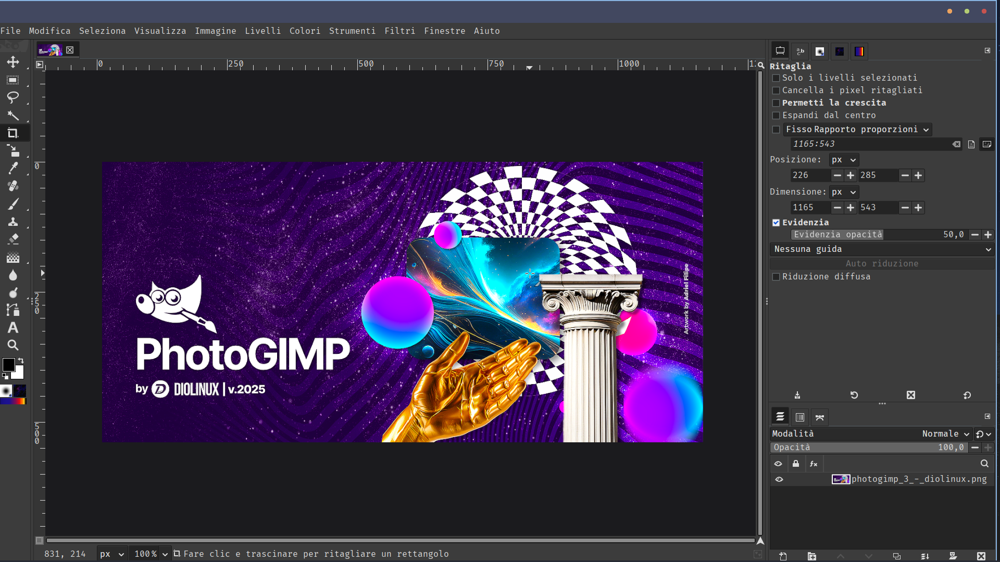

# PhotoGIMP (Versione Italiana) 🇮🇹

Questa è una patch personalizzata per GIMP (2.10 o 3.0+) che trasforma l'interfaccia, le scorciatoie e i plugin per renderli simili ad Adobe Photoshop.

## 📸 Anteprima
Ecco come apparirà il tuo GIMP dopo l'installazione:



## ✨ Novità di questa versione
* **Traduzione Completa:** Documentazione e istruzioni in italiano.
* **Script Intelligente:** Il file `installa_italiano.sh` rileva automaticamente la tua versione di GIMP (Flatpak o Standard) e applica la patch nel posto giusto.
* **Integrazione Geany:** Imposta automaticamente Geany come editor di testo predefinito durante la sincronizzazione.

## 🚀 Installazione Rapida
Apri il terminale nella cartella del progetto e lancia:

```bash
chmod +x installa_italiano.sh
./installa_italiano.sh
